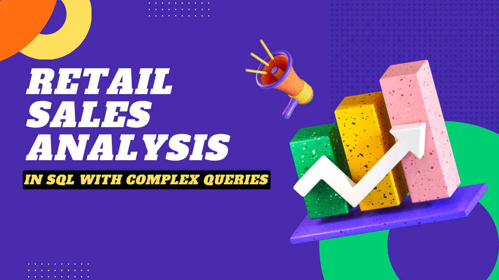

# Retail Sales Analysis SQL Project



## Project Overview

**Project Title**: Retail Sales Analysis  
**Level**: Beginner  
**Database**: `sql_project_p2`

This project is designed to demonstrate SQL skills and techniques typically used by data analysts to explore, clean, and analyze retail sales data. The project involves setting up a retail sales database, performing exploratory data analysis (EDA), and answering specific business questions through SQL queries. This project is ideal for those who are starting their journey in data analysis and want to build a solid foundation in SQL.

## Objectives

1. **Set up a retail sales database**: Create and populate a retail sales database with the provided sales data.
2. **Data Cleaning**: Identify and remove any records with missing or null values.
3. **Exploratory Data Analysis (EDA)**: Perform basic exploratory data analysis to understand the dataset.
4. **Business Analysis**: Use SQL to answer specific business questions and derive insights from the sales data.

## Project Structure

### 1. Database Setup

```sql
Create database sql_project_p2;

create table retail_sales
(
    transactions_id INT PRIMARY KEY,
    sale_date DATE,
    sale_time TIME,	
    customer_id INT,
    gender VARCHAR(15),	
    age INT,
    category VARCHAR(15),
    quantiy INT,
    price_per_unit FLOAT,
    cogs FLOAT,
    total_sale FLOAT
);
```

### 2. Data Exploration & Cleaning

```sql
-- Sample data preview
SELECT * FROM retail_sales LIMIT 10;

-- Record count
SELECT COUNT(*) FROM retail_sales;

-- Check for NULLs
SELECT * FROM retail_sales
WHERE transactions_id IS NULL OR sale_date IS NULL OR sale_time IS NULL OR customer_id IS NULL OR 
      gender IS NULL OR age IS NULL OR category IS NULL OR quantiy IS NULL OR 
      price_per_unit IS NULL OR cogs IS NULL OR total_sale IS NULL;

-- Delete NULLs
DELETE FROM retail_sales
WHERE transactions_id IS NULL OR sale_date IS NULL OR sale_time IS NULL OR customer_id IS NULL OR 
      gender IS NULL OR age IS NULL OR category IS NULL OR quantiy IS NULL OR 
      price_per_unit IS NULL OR cogs IS NULL OR total_sale IS NULL;
```

### 3. Data Analysis & Business Key Problems

```sql
-- Q1: Retrieve all columns for sales made on '2022-11-05'
SELECT * FROM retail_sales WHERE sale_date = '2022-11-05';

-- Q2: Retrieve transactions for 'Clothing' category, quantity > 4, in Nov-2022
SELECT * 
FROM retail_sales 
WHERE category = 'Clothing' 
  AND quantiy >= 4 
  AND TO_CHAR(sale_date, 'YYYY-MM') = '2022-11';

-- Q3: Calculate total sales for each category
SELECT category, SUM(total_sale) AS net_sale, COUNT(*) AS total_sale
FROM retail_sales 
GROUP BY category;

-- Q4: Average age of customers who purchased 'Beauty' products
SELECT ROUND(AVG(age), 2) AS avg_age
FROM retail_sales 
WHERE category = 'Beauty';

-- Q5: Transactions where total_sale > 1000
SELECT * FROM retail_sales WHERE total_sale > 1000;

-- Q6: Total transactions by gender and category
SELECT category, gender, COUNT(transactions_id) AS total_transactions
FROM retail_sales 
GROUP BY gender, category;

-- Q7: Best selling month each year (by avg sale)
SELECT year, month, avg_sale
FROM (
    SELECT 
        EXTRACT(YEAR FROM sale_date) AS year,
        EXTRACT(MONTH FROM sale_date) AS month,
        AVG(total_sale) AS avg_sale,
        RANK() OVER (PARTITION BY EXTRACT(YEAR FROM sale_date) ORDER BY AVG(total_sale)) AS rank
    FROM retail_sales 
    GROUP BY 1, 2
    ORDER BY 1, 2
) AS t1
WHERE rank = 1;

-- Q8: Top 5 customers by total sales
SELECT customer_id, SUM(total_sale) AS max_sale 
FROM retail_sales 
GROUP BY 1 
ORDER BY 2 DESC
LIMIT 5;

-- Q9: Unique customers per category
SELECT COUNT(DISTINCT customer_id) AS unq_customers, category 
FROM retail_sales 
GROUP BY 2;

-- Q10: Shift-wise transaction count
WITH hourly_sale AS (
    SELECT *, 
           CASE 
               WHEN EXTRACT(HOUR FROM sale_time) <= 12 THEN 'Morning'
               WHEN EXTRACT(HOUR FROM sale_time) BETWEEN 12 AND 17 THEN 'afternoon'
               ELSE 'evening'
           END AS shift
    FROM retail_sales
)
SELECT COUNT(transactions_id) AS total_transctions, COUNT(total_sale) AS tot_Sale, shift
FROM hourly_sale
GROUP BY shift;
```

## Findings

- **Customer Demographics**: Includes wide age range and diverse categories.
- **High-Value Transactions**: Many with sales over 1000.
- **Sales Trends**: Variation by month and shift.
- **Customer Insights**: Identifies top customers and high-demand categories.

## Conclusion

This project serves as a comprehensive introduction to SQL for data analysts, covering setup, cleaning, EDA, and query-driven insights. It can inform key business decisions using real-world retail data.

## Author - Shanmukha Sai Bada

This project is part of my portfolio, showcasing the SQL skills essential for data analyst roles. If you have any questions, feedback, or would like to collaborate, feel free to get in touch!

- **LinkedIn**: [Connect with me professionally](https://www.linkedin.com/in/shanmukha-sai-bada/)
